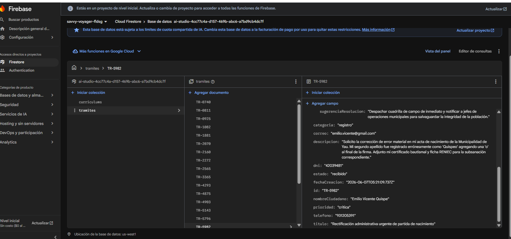
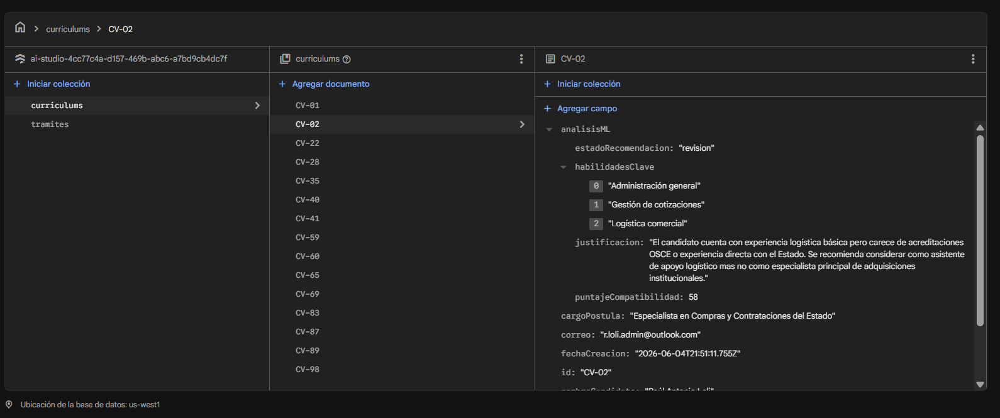
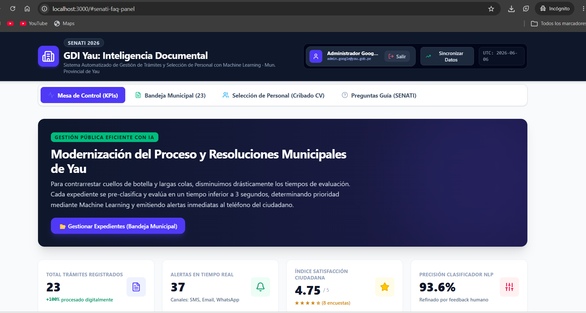
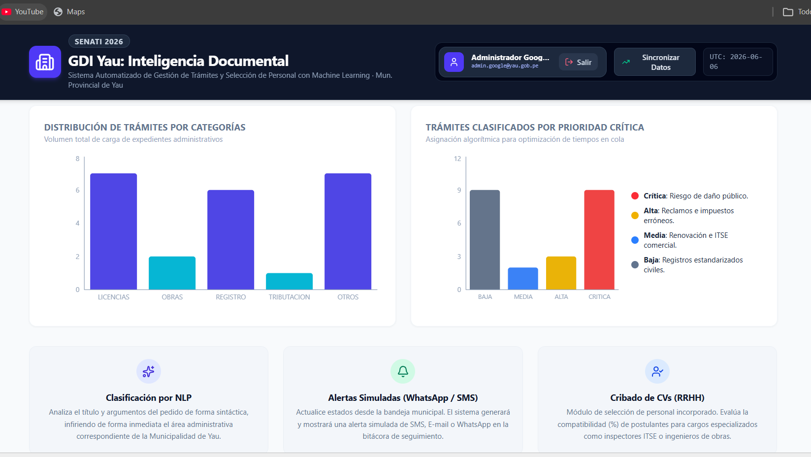
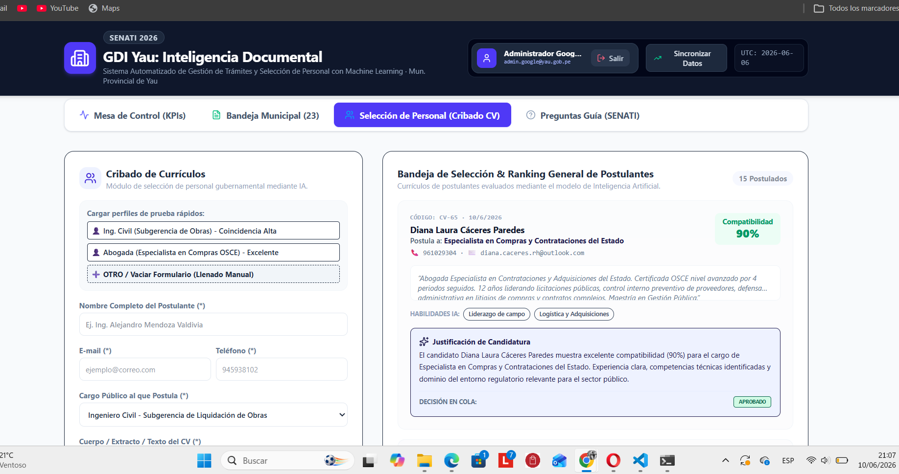
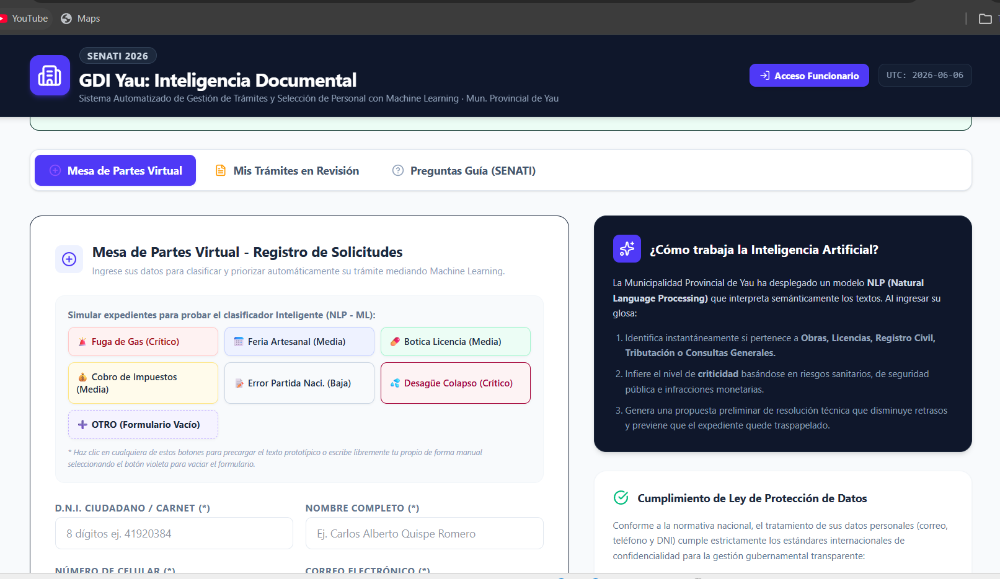

<div align="center">


<br/><br/>



# 🏛️ GDI Yau — Inteligencia Documental

### Sistema Automatizado de Gestión de Trámites y Selección de Personal con Machine Learning
**Municipalidad Provincial de Yau · SENATI 2026**

</div>

---

## 📋 Descripción General

**GDI Yau** es una plataforma web de gestión pública inteligente que moderniza la atención ciudadana y los procesos administrativos de la Municipalidad Provincial de Yau. Utiliza **Procesamiento de Lenguaje Natural (NLP)** para clasificar y priorizar expedientes en menos de 3 segundos, genera alertas automáticas por SMS, Email y WhatsApp, y aplica Machine Learning para el cribado de currículums en procesos de selección de personal.

> 🏆 Proyecto desarrollado para el concurso **SENATI 2026** — Categoría: Sistemas de Información con IA aplicada al sector público.

---

## 🖼️ Capturas del Sistema

### 🏠 Mesa de Control — KPIs en Tiempo Real

> Panel principal con métricas clave: total de trámites, alertas enviadas, satisfacción ciudadana y precisión del clasificador NLP.

<div align="center">

</div>

---

### 📊 Dashboard — Distribución y Prioridad de Trámites

> Visualización de trámites por categoría (Licencias, Obras, Registro, Tributación) y clasificación algorítmica por nivel de prioridad crítica.

<div align="center">

</div>

---

### 📬 Mesa de Partes Virtual — Ciudadano

> Interfaz ciudadana para el registro de solicitudes. Incluye botones de expedientes prototipo para pruebas del clasificador NLP-ML y panel explicativo del funcionamiento de la IA.

<div align="center">

</div>

---

### 👥 Selección de Personal — Cribado de CVs con IA

> Módulo RRHH para evaluación automatizada de postulantes. La IA analiza el currículum, asigna un porcentaje de compatibilidad y genera una justificación de candidatura con decisión en cola (Aprobado / Revisión / Rechazado).

<div align="center">

</div>

---

### 🗄️ Base de Datos — Colección `tramites` (Firebase Firestore)

> Estructura de documentos en Cloud Firestore. Cada trámite almacena: categoría, prioridad, estado, datos del ciudadano, descripción, sugerencia de resolución generada por IA y metadatos de creación.

<div align="center">

</div>

---

### 📁 Base de Datos — Colección `curriculums` (Firebase Firestore)

> Documentos de currículums con análisis ML embebido: estado de recomendación, habilidades clave identificadas, puntaje de compatibilidad y justificación automática generada por el modelo.

<div align="center">

</div>

---

## ⚙️ Funcionalidades Principales

| Módulo | Descripción | Tecnología |
|---|---|---|
| 🤖 **Clasificador NLP** | Categoriza y prioriza trámites al instante desde la glosa del ciudadano | Claude AI / NLP |
| 🔔 **Alertas Simuladas** | Genera notificaciones SMS, Email y WhatsApp al actualizar estados | Simulación en bitácora |
| 👔 **Cribado de CVs** | Evalúa postulantes con % de compatibilidad y justificación IA | Machine Learning |
| 📊 **Dashboard KPIs** | Métricas en tiempo real: trámites, alertas, satisfacción, precisión | Recharts / React |
| 🗂️ **Bandeja Municipal** | Gestión de expedientes por funcionarios con cambio de estado | Firebase Firestore |
| 🌐 **Mesa de Partes** | Portal ciudadano para registro de solicitudes con pre-clasificación | React + Firebase |

---

## 📈 Métricas del Sistema

<div align="center">

| Indicador | Valor |
|---|---|
| 📄 Total Trámites Registrados | **23** |
| 🔔 Alertas en Tiempo Real | **37** (SMS, Email, WhatsApp) |
| ⭐ Índice de Satisfacción Ciudadana | **4.75 / 5** *(8 encuestas)* |
| 🎯 Precisión Clasificador NLP | **93.6%** *(refinado por feedback humano)* |
| ⚡ Tiempo de Clasificación | **< 3 segundos** por expediente |

</div>

---

## 🛠️ Stack Tecnológico

<div align="center">

| Capa | Tecnologías |
|---|---|
| **Frontend** | React.js · Tailwind CSS · Recharts |
| **Backend / BaaS** | Firebase (Firestore · Authentication) |
| **Inteligencia Artificial** | Claude AI (Anthropic) · NLP · ML |
| **Notificaciones** | Simulación SMS · Email · WhatsApp |
| **Hosting** | Firebase Hosting / Vercel |
| **Control de Versiones** | GitHub |

</div>

---

## 🚀 Instalación y Ejecución Local

```bash
# 1. Clonar el repositorio
git clone https://github.com/TU_USUARIO/gdi-yau-inteligencia-documental.git
cd gdi-yau-inteligencia-documental

# 2. Instalar dependencias
npm install

# 3. Configurar variables de entorno
cp .env.example .env.local
# Editar .env.local con tus credenciales de Firebase y API Key de Anthropic

# 4. Ejecutar en modo desarrollo
npm run dev

# 5. Abrir en el navegador
# http://localhost:3000
```

---

## 📁 Estructura del Proyecto

```
gdi-yau/
├── docs/
│   └── screenshots/          # Capturas del sistema (para el README)
├── public/
├── src/
│   ├── components/
│   │   ├── MesaDeControl/    # Dashboard KPIs
│   │   ├── BandejaMunicipal/ # Gestión de expedientes
│   │   ├── CribadoCV/        # Selección de personal
│   │   └── MesaDePartes/     # Portal ciudadano
│   ├── firebase/             # Configuración Firestore
│   ├── services/             # Integración Claude AI / NLP
│   └── App.jsx
├── .env.example
├── package.json
└── README.md
```

---

## 🔐 Variables de Entorno

Crea un archivo `.env.local` con las siguientes variables:

```env
VITE_FIREBASE_API_KEY=tu_api_key
VITE_FIREBASE_AUTH_DOMAIN=tu_proyecto.firebaseapp.com
VITE_FIREBASE_PROJECT_ID=tu_proyecto_id
VITE_FIREBASE_STORAGE_BUCKET=tu_proyecto.appspot.com
VITE_ANTHROPIC_API_KEY=tu_clave_anthropic
```

---

## 📌 Instrucciones para las Capturas

> **Importante:** Para que las imágenes se visualicen correctamente en GitHub, sigue estos pasos:

1. Crea la carpeta `docs/screenshots/` en la raíz de tu repositorio
2. Sube las imágenes con estos nombres exactos:

| Archivo | Descripción |
|---|---|
| `dashboard_kpis.png` | Banner principal del sistema |
| `mesa_control_kpis.png` | Mesa de control con KPIs |
| `dashboard_graficos.png` | Gráficos de distribución y prioridad |
| `mesa_partes_virtual.png` | Portal ciudadano |
| `cribado_cvs.png` | Módulo de selección de personal |
| `firestore_tramites.png` | Colección tramites en Firebase |
| `firestore_curriculums.png` | Colección curriculums en Firebase |

---

## 👨‍💻 Autor

<div align="center">

Desarrollado con ❤️ para la **Municipalidad Provincial de Yau**

**SENATI 2026** — Proyecto de Titulación

[](https://github.com/TU_USUARIO)

</div>

---

<div align="center">
<sub>© 2026 GDI Yau · Inteligencia Documental · Municipalidad Provincial de Yau · SENATI</sub>
</div>
